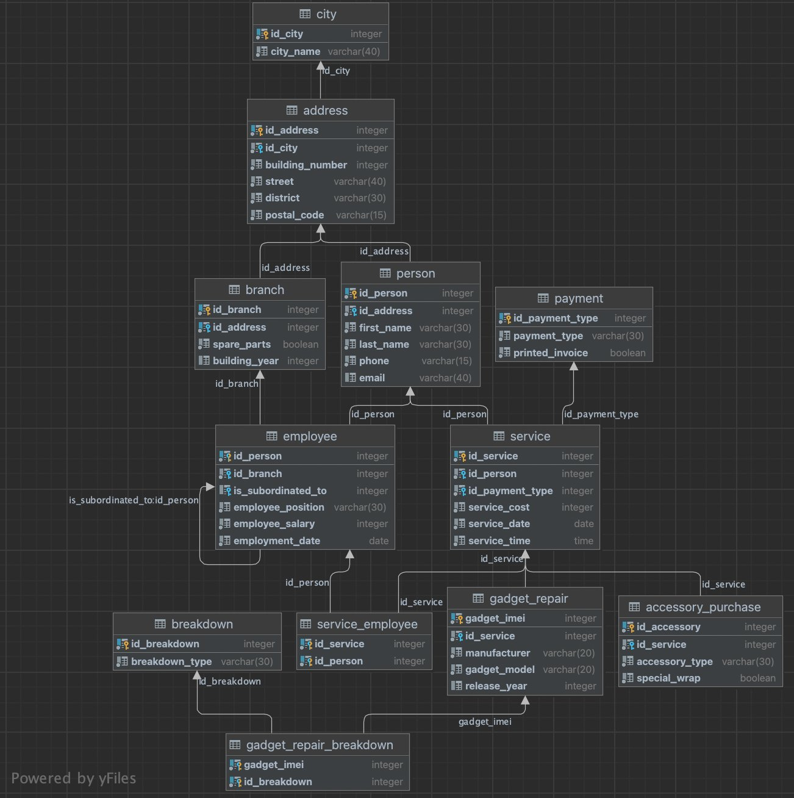

# 1. Data Generation 📑


## Project Structure 📁
- `img/`: Contains image files related to the project.
- `script/`: Contains PL/SQL scripts for data generation.
- `LOG.md`: Log file for tracking project progress.
- `README.md`: The main README file for the project.

## Description of the Entire Phase 🔎
In this phase, conducted within the PL/SQL environment of Oracle, the central goal is to generate meaningful and 
realistic data for specific tables within the original database of another university project. 
The chosen approach involves leveraging Oracle's PL/SQL language to create scripts and implement procedures 
that will systematically populate these tables with synthetic yet representative data.


## Selection of Tables from the Original Database 🖇️
The tables chosen for data generation include `tbl_CLIENT`, `tbl_PAYMENT`, and `tbl_SERVICE`. 
These tables represent essential entities within the system and capture client information, payment details, and service records.

**Original Database:**


**Chosen Database Part:**


## Create Script 📝

### Dynamic Table Drop PL/SQL Block 🪛
In this phase, a dynamic PL/SQL script is devised to manage tables effectively in the Oracle database environment. 
The primary objective is to provide a clean slate for subsequent data generation.

#### Key Elements: 📍
1. **Objective:** Ensure a clean starting point for data generation.

2. **Dynamic Approach:** Utilizes a custom collection type (`type_table_name`) to store table names dynamically.

3. **Table Initialization:** Initializes the collection with targeted table names like 'tbl_SERVICE', 'tbl_CLIENT', 'tbl_PAYMENT'.

4. **Dropping Loop:** Iterates through each specified table, attempting to drop them.

5. **Dynamic DROP TABLE Execution:** Employs `EXECUTE IMMEDIATE` for the dynamic execution of `DROP TABLE` SQL command.

6. **Exception Handling:** Addresses potential exceptions during the drop operation, providing informative messages.

### Table Creation Section 🧷
The subsequent section focuses on creating tables to facilitate the data generation process. 
Each table is meticulously designed to capture specific aspects of the overall data model.

#### 1. `tbl_CLIENT` Table: 👩🏼
- **Objective:** Store client information.

- **Columns:**
  - `col_id`: Auto-generated unique identifier.
  - `col_first_name`, `col_last_name`: Capture client's first and last names.
  - `col_phone`: Records client's phone number.
  - `col_email`: Stores client's email address.

- **Constraints:**
  - Primary Key: `pk_client`.
  
#### 2. `tbl_PAYMENT` Table: 💰
- **Objective:** Track payment details.

- **Columns:**
  - `col_id`: Auto-generated unique identifier.
  - `col_type`: Indicates payment type ('Bank transfer', 'Cash', 'Card').
  - `col_is_printed_invoice`: Reflects whether the invoice is printed ('Y' or 'N').

- **Constraints:**
  - Primary Key: `pk_payment`.
  - Check Constraints: `chk_type`, `chk_is_printed_invoice`.

#### 3. `tbl_SERVICE` Table: 🔧
- **Objective:** Records service transactions.

- **Columns:**
  - `col_id`: Auto-generated unique identifier.
  - `col_client_id`: Foreign key referencing `tbl_CLIENT`.
  - `col_payment_id`: Foreign key referencing `tbl_PAYMENT`.
  - `col_cost`: Captures the cost of the service.
  - `col_datetime`: Represents the timestamp of the service.

- **Constraints:**
  - Primary Key: `pk_service`.
  - Check Constraint: `chk_datetime`.
  - Foreign Keys: `fk_client`, `fk_payment`.


## Procedure 1 - proc_FillClientTable 📇

### Overview: ğŸ”
This procedure is designed to populate the `tbl_CLIENT` table with synthetic yet realistic data. 
The primary focus is on creating diverse client records by incorporating random values for first and last names, phone numbers, and email addresses. 

### Key Elements: 📍
1. **Objective:** Populate `tbl_CLIENT` with realistic, randomly generated data.

2. **Data Generation:**
   - **First Name (`col_first_name`):** Random string of uppercase alphabets (A) with a length between 3 and 15.
   - **Last Name (`col_last_name`):** Random string of uppercase alphabets (A) with a length between 4 and 14.
   - **Phone Number (`col_phone`):** Random numeric string (N) with a value between 1E8 (100000000) and 1E9 - 1 (999999999).
   - **Email (`col_email`):** Concatenation of first name, last name, and '@example.com'.

3. **Exception Handling:** Any errors occurring during the bulk insert operation are caught, and the error message is outputted to DBMS_OUTPUT.

### Procedure Logic: 🤔
1. **Check Existing Records:** The procedure first checks if the `tbl_CLIENT` table is already populated. If records are present, the procedure exits, ensuring data is not duplicated.

2. **Generate Random Data:** For the specified number of client records, random data is generated for each column using the DBMS_RANDOM package.

3. **Bulk Insert:** A bulk insert operation is employed for efficiency, utilizing the FORALL statement to insert all generated client records into the table in a single transaction.

4. **Exception Handling:** In case of any errors during the bulk insert, exception handling captures the error message and raises an exception, providing visibility into potential issues.

5. **Display Record Count:** After successful insertion, the procedure displays the total number of records in the `tbl_CLIENT` table.

### Usage: 💻
```sql
DECLARE
    var_client_count PLS_INTEGER := 50;
BEGIN
    proc_FillClientTable(var_client_count);
END;
```


## Procedure 2 - proc_FillPaymentTable 💵

### Overview: ğŸ”
This procedure is dedicated to populating the `tbl_PAYMENT` table with diverse payment records. 
The primary goal is to introduce randomness into payment types, such as 'Bank transfer', 'Cash', or 'Card', and set indicators for printed invoices ('Y' or 'N').

### Key Elements: 📍
1. **Objective:** Populate `tbl_PAYMENT` with diverse payment records using random data.

2. **Data Generation:**
   - **Payment Type (`col_type`):** Randomly selected from the set ('Bank transfer', 'Cash', 'Card').
   - **Printed Invoice Indicator (`col_is_printed_invoice`):** Random character 'Y' or 'N'.

3. **Exception Handling:** Any errors occurring during the bulk insert operation are caught, and the error message is outputted to DBMS_OUTPUT.

### Procedure Logic: 🤔
1. **Check Existing Records:** The procedure first checks if the `tbl_PAYMENT` table is already populated. If records are present, the procedure exits, avoiding duplication.

2. **Generate Random Data:** For the specified number of payment records, random data is generated for each column using the DBMS_RANDOM package.

3. **Bulk Insert:** A bulk insert operation is employed for efficiency, utilizing the FORALL statement to insert all generated payment records into the table in a single transaction.

4. **Exception Handling:** In case of any errors during the bulk insert, exception handling captures the error message and raises an exception, providing visibility into potential issues.

5. **Display Record Count:** After successful insertion, the procedure displays the total number of records in the `tbl_PAYMENT` table.

### Usage: 💻
```sql
DECLARE
    var_payment_count PLS_INTEGER := 100;
BEGIN
    proc_FillPaymentTable(var_payment_count);
END;
```


## Procedure 3 - proc_FillServiceTable 🔨

### Overview: ğŸ”
This procedure focuses on populating the `tbl_SERVICE` table with synthetic service records. 
The primary goal is to ensure diversity in the dataset by associating random client and payment IDs from existing tables. 

### Key Elements: 📍
1. **Objective:**
   - Populate `tbl_SERVICE` with synthetic service records, ensuring diversity.

2. **Data Generation:**
   - **Client ID (`col_client_id`):** Randomly selected from existing records in `tbl_CLIENT`.
   - **Payment ID (`col_payment_id`):** Randomly selected from existing records in `tbl_PAYMENT`.
   - **Cost (`col_cost`):** Random cost value between 100 and 1000.
   - **Datetime (`col_datetime`):** Random timestamp within the specified range.

3. **Exception Handling:** Any errors occurring during the bulk insert operation are caught, and the error message is outputted to DBMS_OUTPUT.

4. **Prerequisite Checks:**
   - Ensures that `tbl_SERVICE` is empty before proceeding.
   - Verifies that both `tbl_CLIENT` and `tbl_PAYMENT` contain data.

### Procedure Logic: 🤔
1. **Check Existing Records:** The procedure first checks if the `tbl_SERVICE` table is already populated. If records are present, the procedure exits, avoiding duplication.

2. **Fetch Client and Payment IDs:** Client IDs and Payment IDs are fetched from the existing tables (`tbl_CLIENT` and `tbl_PAYMENT`).

3. **Prerequisite Checks:** Verifies that both `tbl_CLIENT` and `tbl_PAYMENT` are not empty. If either table is empty, the procedure exits.

4. **Generate Random Data:** For the specified number of service records, random data is generated for each column using the DBMS_RANDOM package.

5. **Bulk Insert:** A bulk insert operation is employed for efficiency, utilizing the FORALL statement to insert all generated service records into the table in a single transaction.

6. **Exception Handling:** In case of any errors during the bulk insert, exception handling captures the error message and raises an exception, providing visibility into potential issues.

7. **Display Record Count:** After successful insertion, the procedure displays the total number of records in the `tbl_SERVICE` table.

### Usage: 💻
```sql
DECLARE
    var_service_count PLS_INTEGER := 150;
BEGIN
    proc_FillServiceTable(var_service_count);
END;
```


## Reflections and Learnings 🌟

This phase of the project was a deep dive into the complexities of generating realistic data within the Oracle database. 
It highlighted the effectiveness of PL/SQL in creating robust scripts and procedures for data generation, ensuring data accuracy and consistency. 
The learning experience was invaluable, providing a solid foundation for more advanced database applications in future projects. 🚀
