# Logs 💾

## Create Script
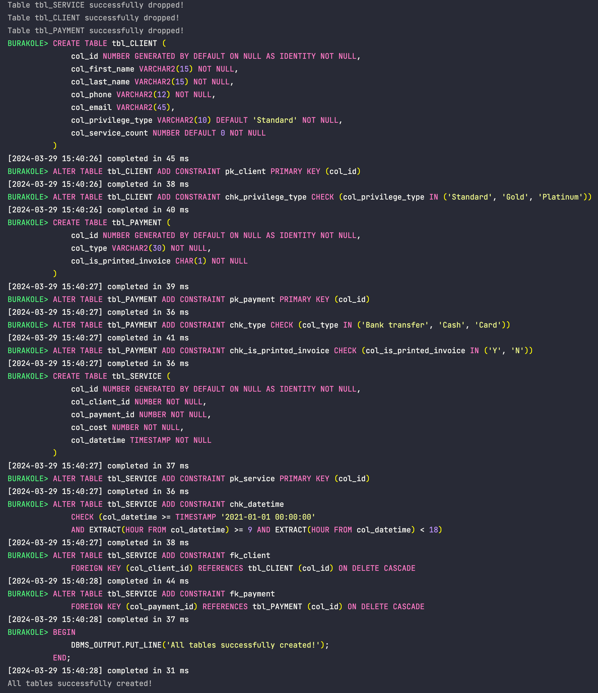

## Package Init
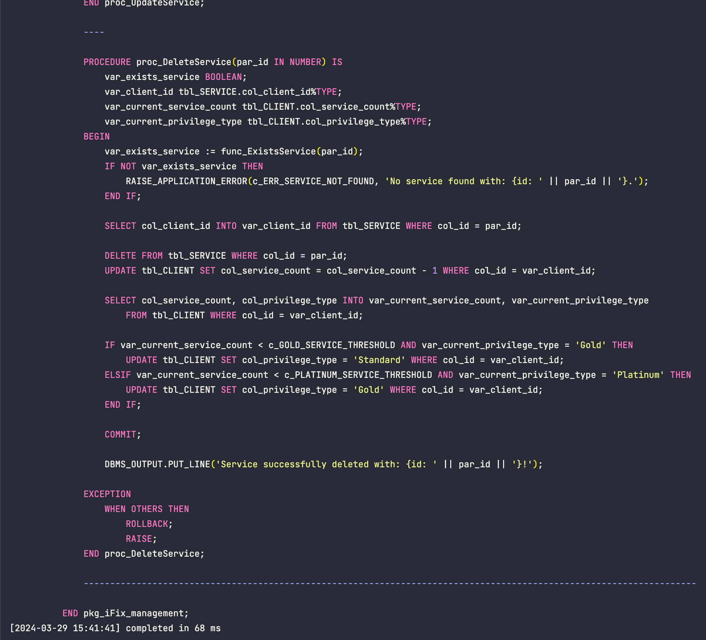

## Package Client Operations
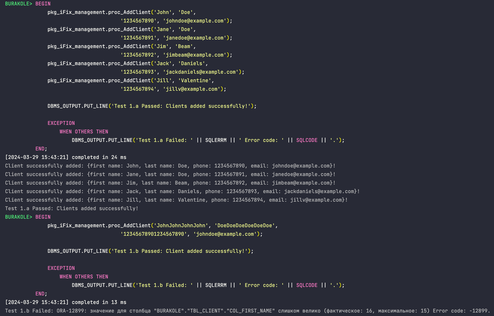
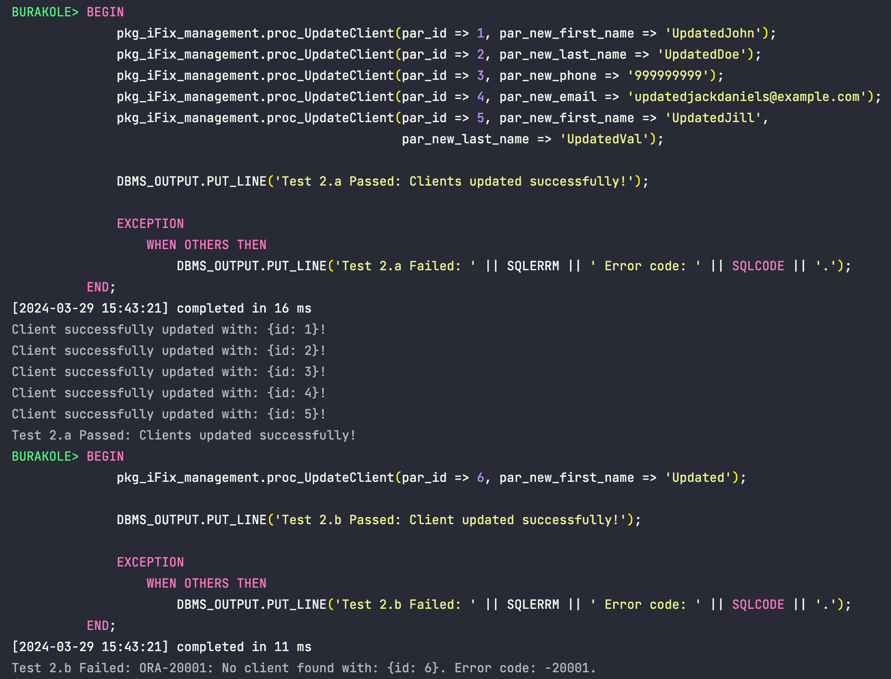
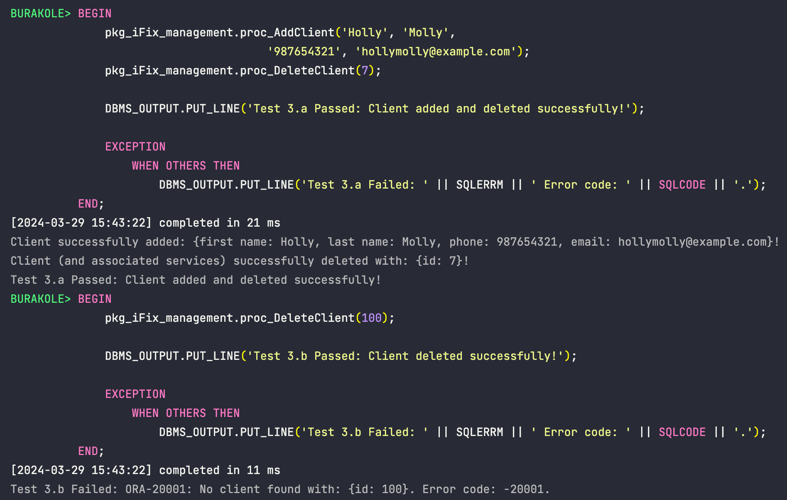

## Package Payment Operations

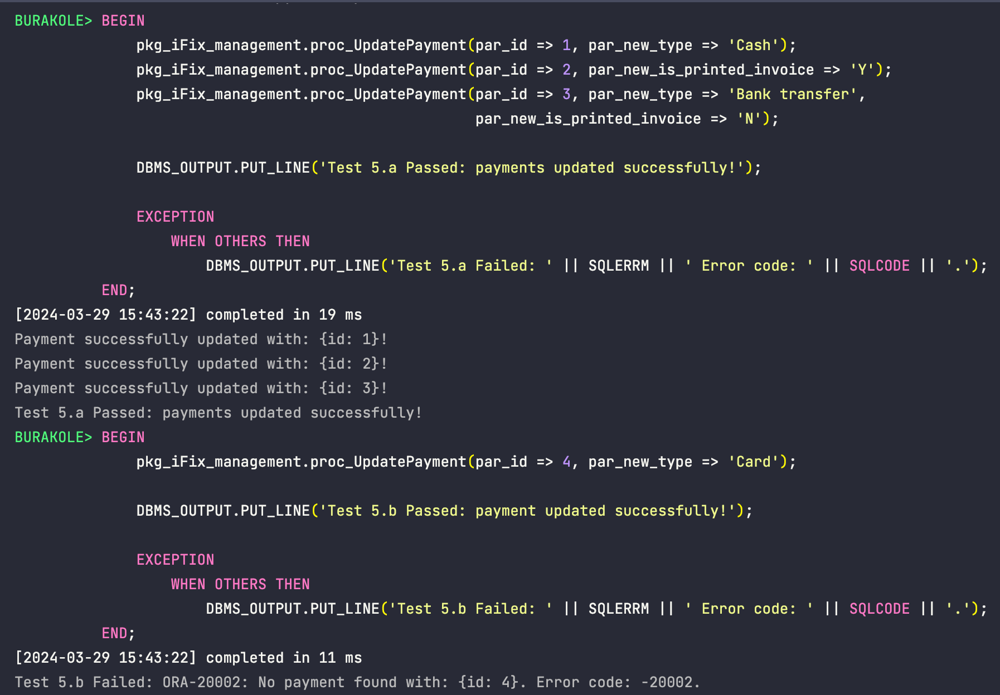
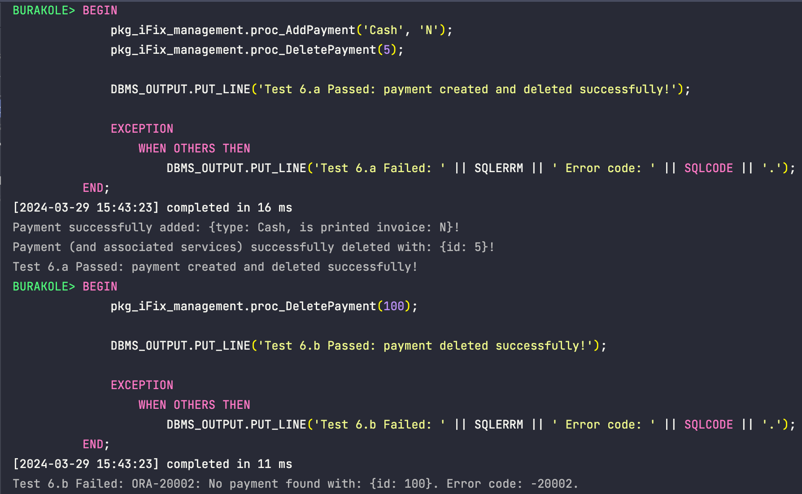

## Package Service Operations
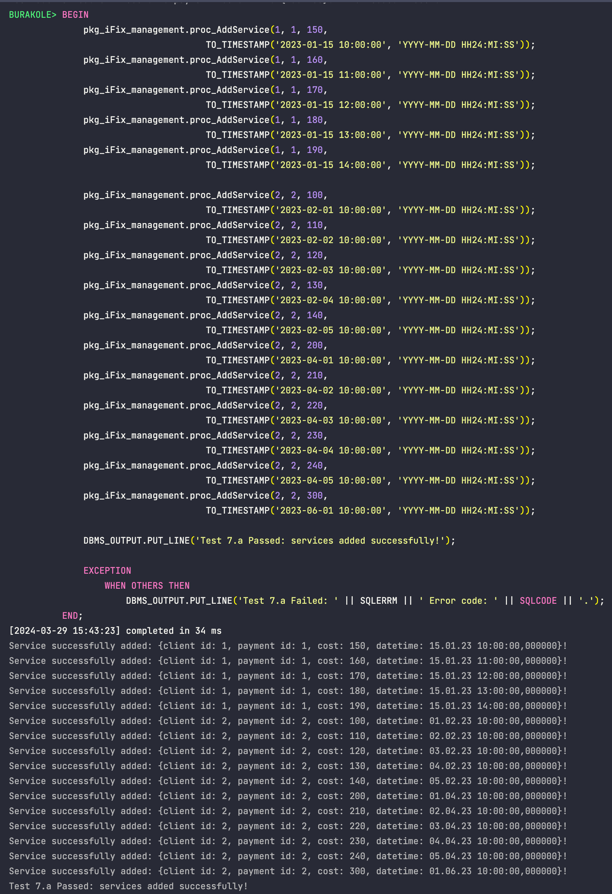
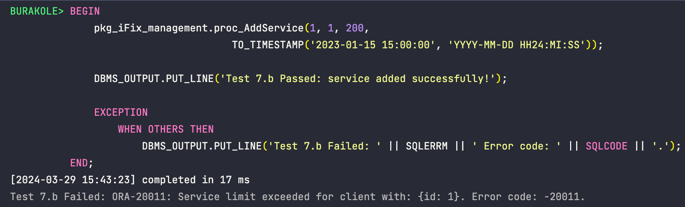
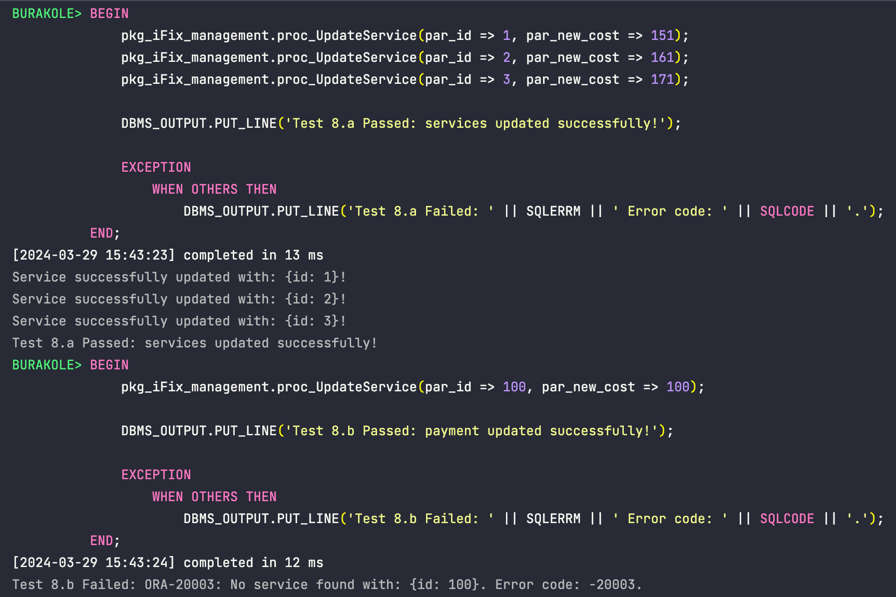
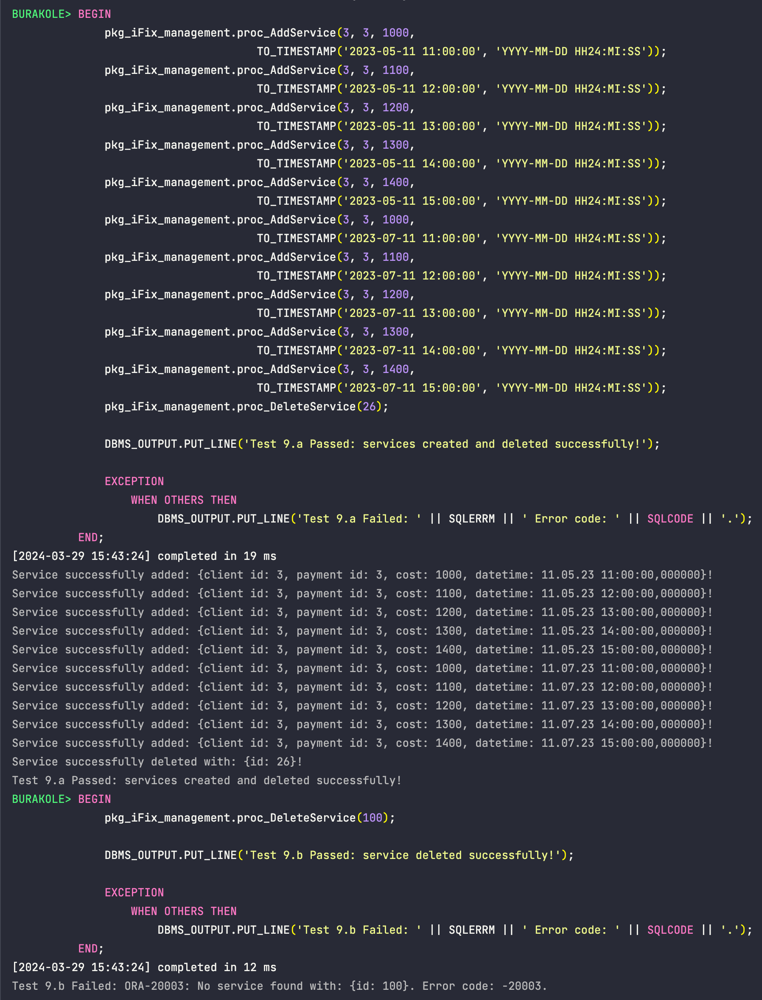

## Tables After Package Tests
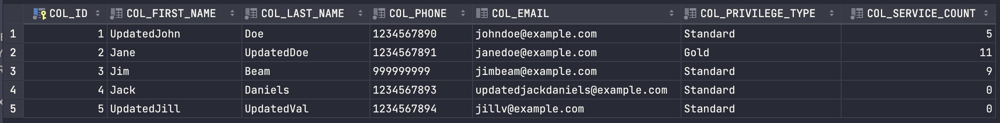
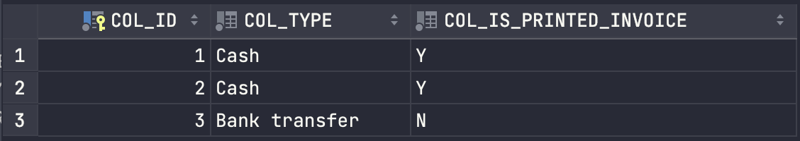
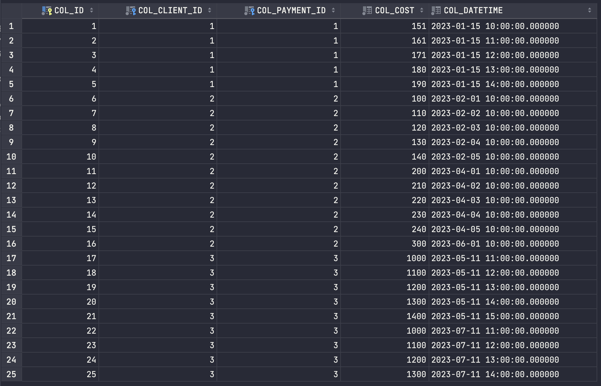

## Trigger Init
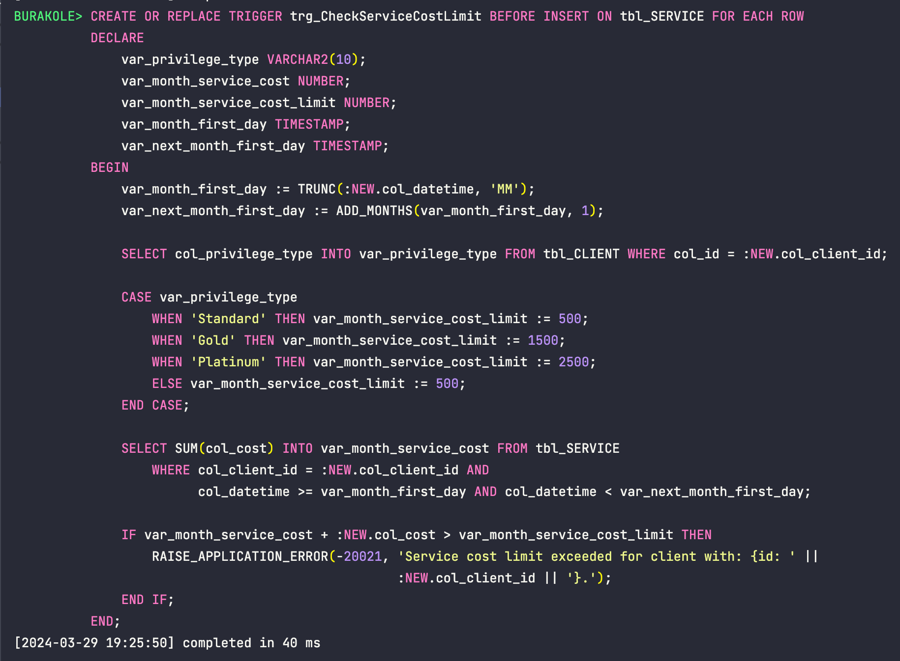

## Trigger Service Operation
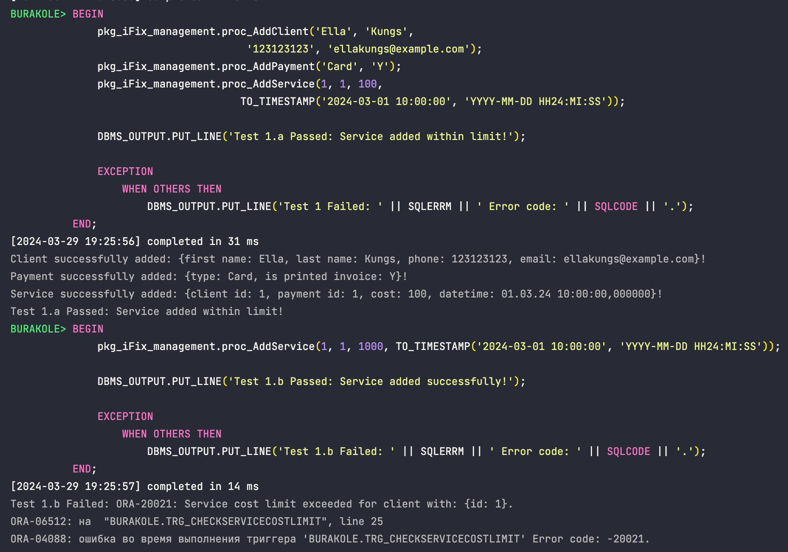
