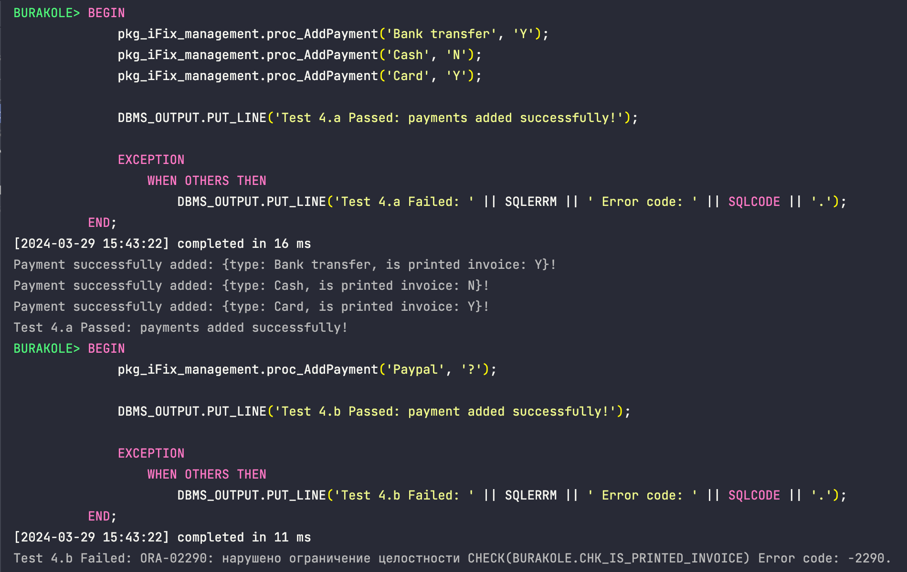

# Logs 💾

## Create Script

## Package Init

## Package Client Operations

## Package Payment Operations

## Package Service Operations

## Tables After Package Tests

## Trigger Init

## Trigger Service Operation

