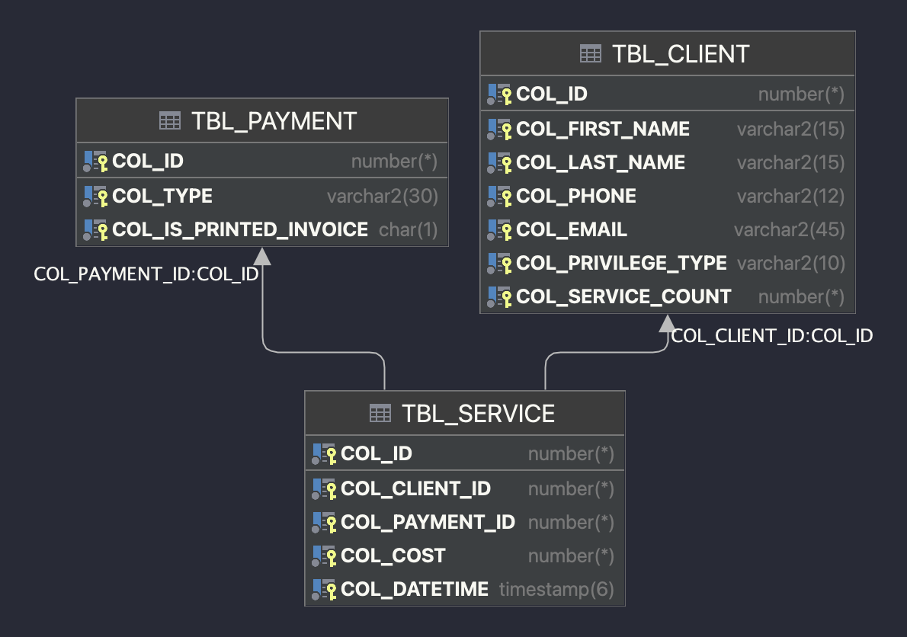

# 2. Implementation of Complex Integrity Constraints 🛠️

## Project Structure 📁
- `img/`: Contains image files related to the project.
- `script/`: Contains PL/SQL scripts for data generation and processing.
- `LOG.md`: Log file for tracking project progress.
- `README.md`: The main README file for the project.

## Overview of the Phase 🔍
In this second phase of the project, we aimed to implement complex integrity constraints in the Oracle database environment. 
This phase involved two primary components: a package of procedures (`pkg_iFix_management`) for advanced data manipulation, 
and a trigger (`trg_CheckServiceCostLimit`) to enforce a unique business rule. 
These components are designed to uphold the integrity and logical consistency of the data in a more sophisticated way 
than standard constraints.

**Actual Database State:**

## Package Implementation: `pkg_iFix_management` 📦

### Purpose and Functionality 🎯
1. **Objective:** The package is designed to manage Create/Update/Delete operations for `tbl_CLIENT`, `tbl_PAYMENT`, 
and `tbl_SERVICE` tables, while incorporating complex business logic.

2. **Complex Integrity Constraints:** 
   - **Privilege Type System:** The package implements a sophisticated client privilege system. 
   Clients are categorized into 'Standard', 'Gold', and 'Platinum', based on the number of services availed.
   
   - **Automated Privilege Upgrades:** As clients reach certain service thresholds, 
   their privilege type is automatically upgraded, enhancing their benefits and service limits.

3. **Enhanced Business Rules:** 
   - **Monthly Service Limits:** The package enforces limits on the number of services a client can use monthly, 
   which varies based on their privilege type.
   
   - **Service Count Tracking:** It keeps track of the total number of services availed by each client, 
   crucial for managing privilege types.

### Key Elements 📍
1. **Custom Error Codes:** Constants like `c_ERR_CLIENT_NOT_FOUND` enhance error readability and clarity, 
aiding in precise debugging and user feedback.

2. **Procedural Approach:** Operations are handled through specialized procedures, 
each designed to ensure data integrity and enforce business rules seamlessly.

3. **Additional Checks:** 
   - **Service Limit Check:** `func_CheckServiceLimit` ensures that clients do not exceed their monthly service quota, 
   considering their current privilege type.
   
   - **Privilege Type Maintenance:** Procedures within the package automatically adjust client types based on their 
   service usage, ensuring dynamic and accurate privilege management.

### Implementing Business Logic with Procedures 🧩
- **Automated Type Advancement:** Procedures like `proc_AddService` and `proc_DeleteService` not only 
manage service records but also automatically adjust client privilege tiers based on the updated service count.

- **Integrated Checks:** Before performing operations like adding a new service, procedures internally invoke 
functions like `func_CheckServiceLimit` to validate against business rules, ensuring data consistency and integrity.

## Trigger Implementation: `trg_CheckServiceCostLimit` ⚙️

### Purpose and Functionality 🎯
1. **Objective:** The trigger is designed to impose a financial cap on the services provided to a client within a month. 
This cap varies according to the client's privilege level ('Standard', 'Gold', or 'Platinum'), 
aligning with tailored business rules.

2. **Real-Time Validation:** Activated before each insertion into `tbl_SERVICE`, 
the trigger performs a preemptive check to ensure that the total cost of services for a client 
in the current month does not exceed their privilege tier's allotted budget.

### Key Elements 📍
1. **Dynamic Monthly Calculation:** Calculates the accumulated service costs for a client for the current month, 
ensuring real-time accuracy and relevance.

2. **Client Type-Based Limits:**
   - **Standard Clients:** A more conservative monthly service cost limit.
   
   - **Gold Clients:** A moderately increased service cost limit, reflecting their elevated status.
   
   - **Platinum Clients:** The highest permissible service cost limit, catering to their premium type.

3. **Preventive Action:** If adding a new service record would cause the client's monthly service cost to surpass their type's limit, 
the trigger proactively prevents the record's insertion.

4. **Enhanced Data Integrity:** Ensures financial fairness and prevents budget overruns by aligning service provision 
with client privilege types.

## Testing Scenarios for `pkg_iFix_management` and `trg_CheckServiceCostLimit` 🧪

### Approach: Positive and Negative Cases 🔄
- **Positive Tests (.a):** Validate correct functionality. These tests verify that operations like adding, updating, 
and deleting clients, payments, and services proceed without errors when executed under normal, rule-compliant conditions.

- **Negative Tests (.b):** Check error handling and constraint enforcement. These tests are designed to intentionally 
trigger errors (e.g., exceeding service cost limits, updating non-existent records) to ensure that the package procedures 
and trigger correctly enforce the business rules and handle exceptions.

### Automated Testing Procedure 🤖
1. **Script Execution:** Each test was run using PL/SQL scripts in the Oracle environment.

2. **Validation:**
   - For positive tests, success is indicated when operations complete without errors.
   - For negative tests, appropriate error codes (e.g., `c_ERR_CLIENT_NOT_FOUND`, `c_ERR_SERVICE_LIMIT_EXCEEDED`) are expected. 
   The tests succeed if these specific errors are raised.
   
3. **Output Documentation:** The results, including any error messages and codes, were recorded using `DBMS_OUTPUT.PUT_LINE`. 
This approach provided a comprehensive overview of the tests' outcomes.

## Reflections and Learnings 🌟
This phase of the project was a deep dive into the complexities of enforcing business logic directly within the database. 
It highlighted the power of PL/SQL in creating robust and logically consistent data layers, 
ensuring data integrity beyond the usual constraint mechanisms. 
The learning curve was steep, yet rewarding, paving the way for more advanced database applications. 📈
