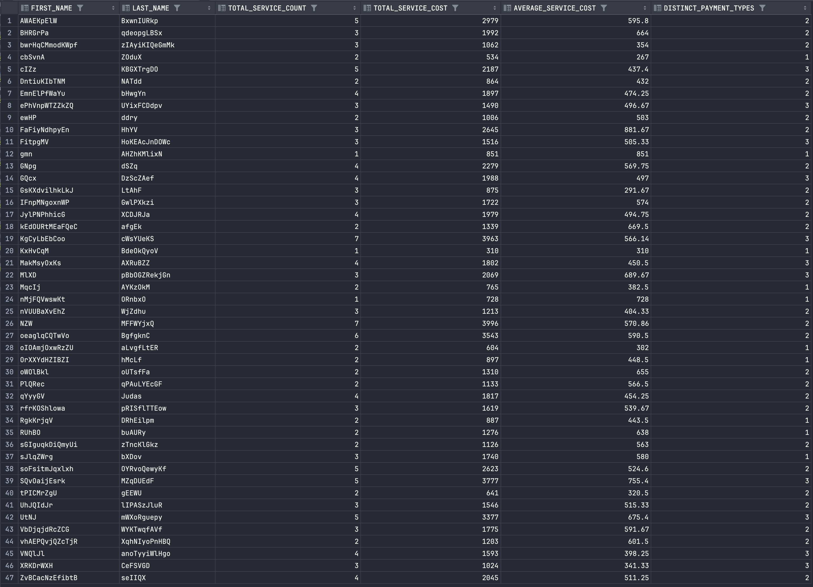
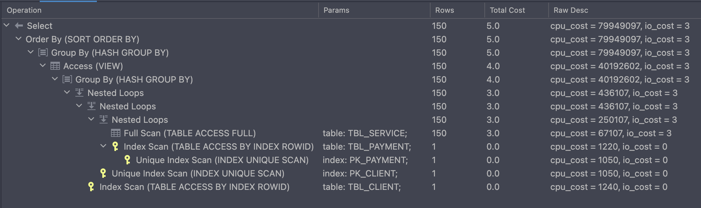
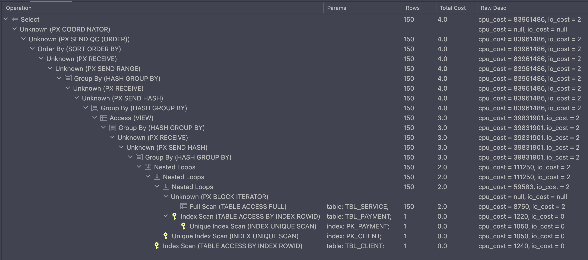
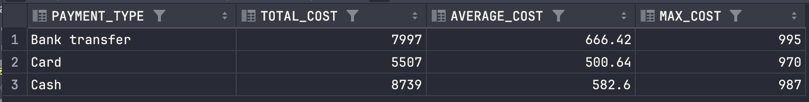
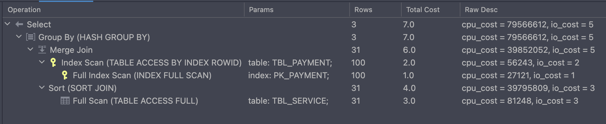
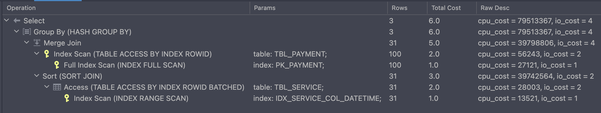
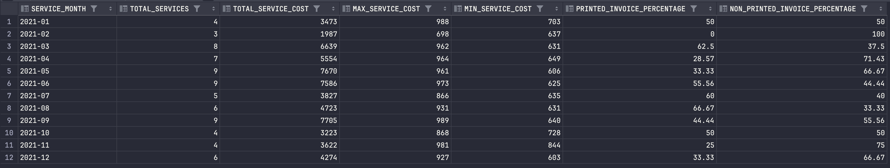
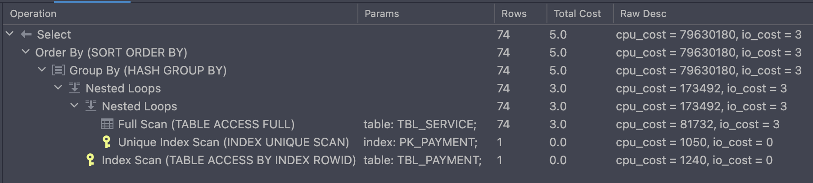
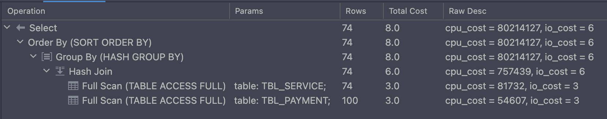

# Log of SQL Query Optimization and Analysis 📜

## Description of the Optimizations  🔎
This document details the optimization process for three SQL queries, 
including their initial execution plans, the changes made to improve performance, 
and the resulting execution plans. 
Each query has been thoroughly analyzed and optimized using various techniques such as 
indexing, different join methods, and parallel execution.


## Query 1: Analyzing Client Stats with Sorting 🧩

### Base Query, Obtained Data Table and Execution Plan 🛠️

**Base Query:**
```sql
/*
Query to analyze client stats with sorting:

This SQL query analyzes client and payment statistics, including the total and average cost of services,
the number of different payment types used, and the number of services provided for each client.
The results are sorted by client's first name, last name, and the count of different payment types.

Data Analysis:
- The query joins the tbl_CLIENT, tbl_SERVICE, and tbl_PAYMENT tables.
- Groups the results by client's first and last names and calculates COUNT, SUM, AVG, and distinct payment types.

Query Components:
- First name (first_name): The first name of the client.
- Last name (last_name): The last name of the client.
- Service count (total_service_count): The count of services provided to each client.
- Total cost (total_service_cost): The total cost of services for each client.
- Average cost (average_service_cost): The average cost of services for each client, rounded to 2 decimal places.
- Distinct payment types (distinct_payment_types): The count of different payment types used by each client.

Sorting:
- The results are sorted by client's first name, last name, and the count of different payment types.
*/
SELECT
    client.col_first_name AS first_name,
    client.col_last_name AS last_name,
    COUNT(service.col_id) AS total_service_count,
    SUM(service.col_cost) AS total_service_cost,
    ROUND(AVG(service.col_cost), 2) AS average_service_cost,
    COUNT(DISTINCT payment.col_type) AS distinct_payment_types
FROM tbl_CLIENT client
JOIN tbl_SERVICE service ON client.col_id = service.col_client_id
JOIN tbl_PAYMENT payment ON service.col_payment_id = payment.col_id
GROUP BY client.col_first_name, client.col_last_name
ORDER BY first_name, last_name, distinct_payment_types;
```

**Obtained Data Table:**


**Base Execution Plan:**


### Optimized Query, Execution Plan and Details 🚀

**Optimized Query:**
```sql
CREATE INDEX idx_service_col_client_id ON tbl_SERVICE(col_client_id);

CREATE INDEX idx_service_col_payment_id ON tbl_SERVICE(col_payment_id);

CREATE INDEX idx_client_first_last_name ON tbl_CLIENT(col_first_name, col_last_name);

/*
Optimized Query to analyze client stats with sorting:

This SQL query analyzes client and payment statistics, including the total and average cost of services,
the number of different payment types used, and the number of services provided for each client.
The results are sorted by client's first name, last name, and the count of different payment types.
The query has been optimized by adding indexes and using nested loop and parallel execution hints to improve performance.

Optimization Details:
- Index on `tbl_SERVICE.col_client_id`: Improves the join performance between `tbl_CLIENT` and `tbl_SERVICE`.
- Index on `tbl_SERVICE.col_payment_id`: Improves the join performance between `tbl_SERVICE` and `tbl_PAYMENT`.
- Index on `tbl_CLIENT.col_first_name` and `tbl_CLIENT.col_last_name`: Improves the sort performance.
- The `USE_NL` hint is used to indicate the use of nested loop joins.
- The `PARALLEL` hint is used to enable parallel execution for the `tbl_SERVICE` table.

Data Analysis:
- The query joins the tbl_CLIENT, tbl_SERVICE, and tbl_PAYMENT tables.
- Groups the results by client's first and last names and calculates COUNT, SUM, AVG, and distinct payment types.

Query Components:
- First name (first_name): The first name of the client.
- Last name (last_name): The last name of the client.
- Service count (total_service_count): The count of services provided to each client.
- Total cost (total_service_cost): The total cost of services for each client.
- Average cost (average_service_cost): The average cost of services for each client, rounded to 2 decimal places.
- Distinct payment types (distinct_payment_types): The count of different payment types used by each client.

Sorting:
- The results are sorted by client's first name, last name, and the count of different payment types.
*/
SELECT /*+ USE_NL(service payment) USE_NL(client service) PARALLEL(service 4) */
    client.col_first_name AS first_name,
    client.col_last_name AS last_name,
    COUNT(service.col_id) AS total_service_count,
    SUM(service.col_cost) AS total_service_cost,
    ROUND(AVG(service.col_cost), 2) AS average_service_cost,
    COUNT(DISTINCT payment.col_type) AS distinct_payment_types
FROM tbl_CLIENT client
JOIN tbl_SERVICE service ON client.col_id = service.col_client_id
JOIN tbl_PAYMENT payment ON service.col_payment_id = payment.col_id
GROUP BY client.col_first_name, client.col_last_name
ORDER BY first_name, last_name, distinct_payment_types;
```

**Optimized Execution Plan:**


**Optimization Details:**
- ***Indexing:*** Created indexes on `tbl_SERVICE.col_client_id`, `tbl_SERVICE.col_payment_id`, 
                  and `tbl_CLIENT.col_first_name`, `col_last_name`.
- ***Join Method:*** Used `USE_NL hint` to enforce nested loop joins. Applied `PARALLEL hint` for parallel execution.

**Evaluation:**
- The optimization successfully reduced the **execution cost** by improving join efficiency and enabling parallel execution. 
  The nested loop joins were particularly effective due to the newly created indexes.


## Query 2: Analyzing Payment Stats 💳

### Base Query, Obtained Data Table and Execution Plan 🛠️

**Base Query:**
```sql
/*
Query to analyze payments stats:

This SQL query analyzes payment types and their associated service costs. It calculates the total, average, and maximum
cost of services for each payment type within a specific date range.

Data Analysis:
- The query joins the tbl_PAYMENT and tbl_SERVICE tables.
- Filters services based on the col_datetime range from '2021-03-01' to '2021-06-01'.
- Groups the results by payment type and calculates SUM, AVG, and MAX of service costs.

Query Components:
- Payment type (col_type): The type of payment (e.g., 'Bank transfer', 'Cash', 'Card').
- Total cost (total_cost): The total cost of services for each payment type.
- Average cost (average_cost): The average cost of services for each payment type, rounded to 2 decimal places.
- Maximum cost (max_cost): The maximum cost of services for each payment type.
*/
SELECT
    payment.col_type AS payment_type,
    SUM(service.col_cost) AS total_cost,
    ROUND(AVG(service.col_cost), 2) AS average_cost,
    MAX(service.col_cost) AS max_cost
FROM tbl_PAYMENT payment
JOIN tbl_SERVICE service ON payment.col_id = service.col_payment_id
WHERE service.col_datetime >= TIMESTAMP '2021-03-01 00:00:00' AND service.col_datetime < TIMESTAMP '2021-06-01 00:00:00'
GROUP BY payment.col_type;
```

**Obtained Data Table:**


**Base Execution Plan:**


### Optimized Query, Execution Plan and Details 🚀

**Optimized Query:**
```sql
CREATE INDEX idx_service_col_datetime ON tbl_SERVICE(col_datetime);

CREATE INDEX idx_service_col_payment_id ON tbl_SERVICE(col_payment_id);

/*
Optimized Query to analyze payments stats:

This SQL query analyzes payment types and their associated service costs. It calculates the total, average, and maximum
cost of services for each payment type within a specific date range. The query has been optimized by adding indexes to
improve performance.

Optimization Details:
- Two indexes have been created to speed up the query execution.
  1. Index on `tbl_SERVICE.col_datetime`: Helps to efficiently filter the services by the date range.
  2. Index on `tbl_SERVICE.col_payment_id`: Improves the join performance between `tbl_PAYMENT` and `tbl_SERVICE`.

Data Analysis:
- The query joins the tbl_PAYMENT and tbl_SERVICE tables.
- Filters services based on the col_datetime range from '2021-03-01' to '2021-06-01'.
- Groups the results by payment type and calculates SUM, AVG, and MAX of service costs.

Query Components:
- Payment type (col_type): The type of payment (e.g., 'Bank transfer', 'Cash', 'Card').
- Total cost (total_cost): The total cost of services for each payment type.
- Average cost (average_cost): The average cost of services for each payment type, rounded to 2 decimal places.
- Maximum cost (max_cost): The maximum cost of services for each payment type.
*/
SELECT
    payment.col_type AS payment_type,
    SUM(service.col_cost) AS total_cost,
    ROUND(AVG(service.col_cost), 2) AS average_cost,
    MAX(service.col_cost) AS max_cost
FROM tbl_PAYMENT payment
JOIN tbl_SERVICE service ON payment.col_id = service.col_payment_id
WHERE service.col_datetime >= TIMESTAMP '2021-03-01 00:00:00' AND service.col_datetime < TIMESTAMP '2021-06-01 00:00:00'
GROUP BY payment.col_type;
```

**Optimized Execution Plan:**


**Optimization Details:**
- ***Indexing:*** Created indexes on `tbl_SERVICE.col_datetime` and `tbl_SERVICE.col_payment_id`.

**Evaluation:**
- The optimization led to a more efficient execution plan by leveraging indexes for filtering and joining, 
  significantly reducing the execution cost.


## Query 3: Analyzing Services for Each Month of 2021 📆

### Base Query, Obtained Data Table and Execution Plan 🛠️

**Base Query:**
```sql
/*
Query to analyze services for each month of 2021 with cost greater than 600:

This SQL query analyzes services provided in each month of 2021 where the service cost is greater than 600.
It calculates the total number of such services, their total cost, the maximum and minimum cost,
and the percentage of printed and non-printed invoices for each month.

Data Analysis:
- The query joins the tbl_SERVICE and tbl_PAYMENT tables.
- Filters services for the year 2021 and where the service cost is greater than 600.
- Groups the results by month and calculates COUNT, SUM, MAX, MIN, and percentage of printed and non-printed invoices.

Query Components:
- Month (service_month): The month of the service in the format 'YYYY-MM'.
- Service count (total_services): The total number of services with cost greater than 600.
- Total cost (total_cost): The total cost of services with cost greater than 600.
- Maximum cost (max_cost): The maximum cost of services with cost greater than 600.
- Minimum cost (min_cost): The minimum cost of services with cost greater than 600.
- Printed invoice percentage (printed_invoice_percentage): The percentage of services with printed invoices.
- Non-printed invoice percentage (non_printed_invoice_percentage): The percentage of services without printed invoices.
*/
SELECT
    TO_CHAR(service.col_datetime, 'YYYY-MM') AS service_month,
    COUNT(service.col_id) AS total_services,
    SUM(service.col_cost) AS total_service_cost,
    MAX(service.col_cost) AS max_service_cost,
    MIN(service.col_cost) AS min_service_cost,
    ROUND(SUM(CASE WHEN payment.col_is_printed_invoice = 'Y' THEN 1 ELSE 0 END)
              * 100.0 / COUNT(service.col_id), 2) AS printed_invoice_percentage,
    ROUND(SUM(CASE WHEN payment.col_is_printed_invoice = 'N' THEN 1 ELSE 0 END)
              * 100.0 / COUNT(service.col_id), 2) AS non_printed_invoice_percentage
FROM tbl_SERVICE service
JOIN tbl_PAYMENT payment ON service.col_payment_id = payment.col_id
WHERE service.col_cost > 600
  AND EXTRACT(YEAR FROM service.col_datetime) = 2021
GROUP BY TO_CHAR(service.col_datetime, 'YYYY-MM')
ORDER BY service_month;
```

**Obtained Data Table:**


**Base Execution Plan:**


### Optimized Query, Execution Plan and Details 🚀

**Optimized Query:**
```sql
CREATE INDEX idx_service_col_datetime ON tbl_SERVICE(col_datetime);

CREATE INDEX idx_service_col_payment_id ON tbl_SERVICE(col_payment_id);

/*
Optimized Query to analyze services for each month of 2021 with cost greater than 600:

This SQL query analyzes services provided in each month of 2021 where the service cost is greater than 600.
It calculates the total number of such services, their total cost, the maximum and minimum cost,
and the percentage of printed and non-printed invoices for each month.
The query has been optimized by adding indexes and using hash join and parallel execution hints to improve performance.

Optimization Details:
- Index on tbl_SERVICE.col_datetime: Improves the filtering performance by the date.
- Index on tbl_SERVICE.col_payment_id: Improves the join performance between tbl_SERVICE and tbl_PAYMENT.
- The USE_HASH hint indicates the use of hash join, which is efficient for large datasets without good indexes for nested loops.

Data Analysis:
- The query joins the tbl_SERVICE and tbl_PAYMENT tables.
- Filters services for the year 2021 and where the service cost is greater than 600.
- Groups the results by month and calculates COUNT, SUM, MAX, MIN, and percentage of printed and non-printed invoices.

Query Components:
- Month (service_month): The month of the service in the format 'YYYY-MM'.
- Service count (total_services): The total number of services with cost greater than 600.
- Total cost (total_cost): The total cost of services with cost greater than 600.
- Maximum cost (max_cost): The maximum cost of services with cost greater than 600.
- Minimum cost (min_cost): The minimum cost of services with cost greater than 600.
- Printed invoice percentage (printed_invoice_percentage): The percentage of services with printed invoices.
- Non-printed invoice percentage (non_printed_invoice_percentage): The percentage of services without printed invoices.

Sorting:
- The results are sorted by service month.
*/
SELECT /*+ USE_HASH(service payment) */
    TO_CHAR(service.col_datetime, 'YYYY-MM') AS service_month,
    COUNT(service.col_id) AS total_services,
    SUM(service.col_cost) AS total_service_cost,
    MAX(service.col_cost) AS max_service_cost,
    MIN(service.col_cost) AS min_service_cost,
    ROUND(SUM(CASE WHEN payment.col_is_printed_invoice = 'Y' THEN 1 ELSE 0 END)
              * 100.0 / COUNT(service.col_id), 2) AS printed_invoice_percentage,
    ROUND(SUM(CASE WHEN payment.col_is_printed_invoice = 'N' THEN 1 ELSE 0 END)
              * 100.0 / COUNT(service.col_id), 2) AS non_printed_invoice_percentage
FROM tbl_SERVICE service
JOIN tbl_PAYMENT payment ON service.col_payment_id = payment.col_id
WHERE service.col_cost > 600
  AND EXTRACT(YEAR FROM service.col_datetime) = 2021
GROUP BY TO_CHAR(service.col_datetime, 'YYYY-MM')
ORDER BY service_month;
```

**Optimized Execution Plan:**


**Optimization Details:**
- ***Indexing:*** Created indexes on `tbl_SERVICE.col_datetime` and `tbl_SERVICE.col_payment_id`.
- ***Join Method:*** Used `USE_HASH hint` to enforce hash joins for efficient large dataset joins.

**Evaluation:**
- Overall **execution cost** increased due to the additional cost associated with the _hash join_ operation.
- The full scans on both `tbl_SERVICE` and `tbl_PAYMENT` tables indicate that the _hash join_ might not be the best 
  choice for this query, as it performs better with indexed _nested loops_ in this case.
- The _nested loop join_ in the base plan was more efficient given the available indexes, 
  highlighting the importance of choosing the appropriate join method based on the data distribution and indexing strategy.
