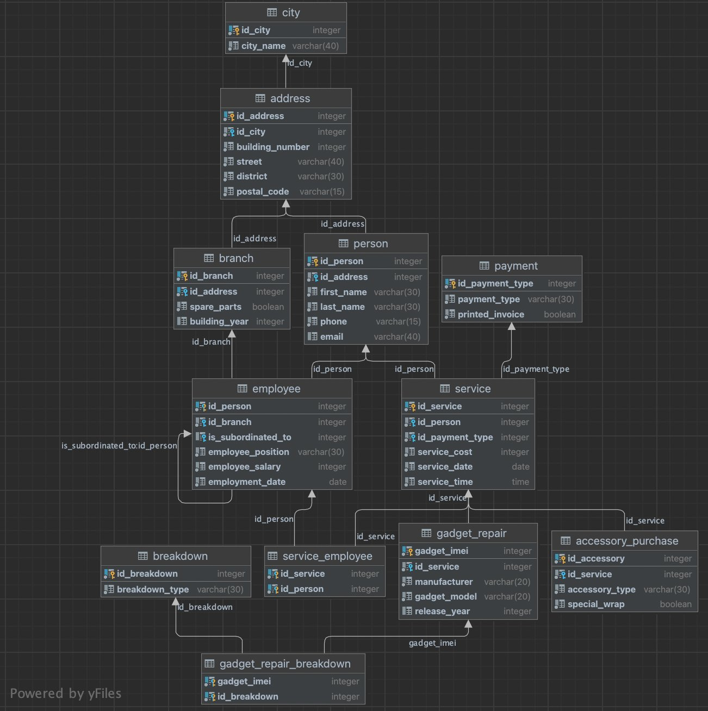
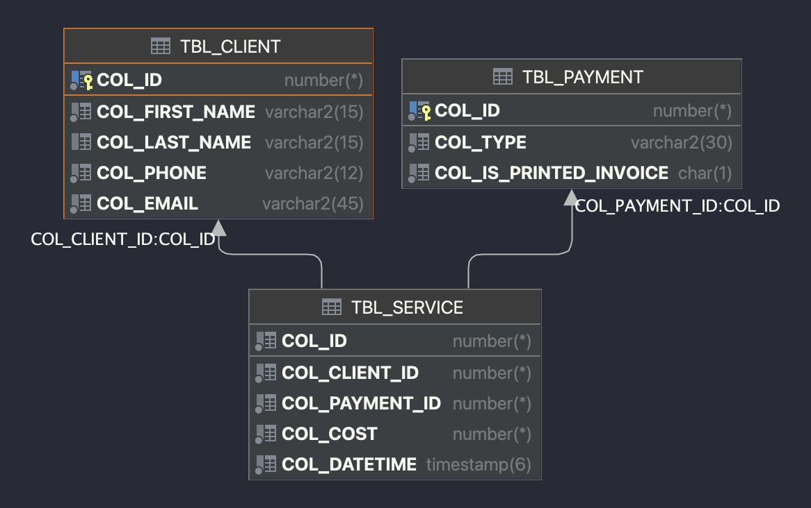

# 4. SQL Query Optimization and Analysis 🛠️

## Project Structure 📁
- `img/`: Contains image files related to the project.
- `procedure/`: Contains procedures for the project.
- `query/`: Contains SQL queries for analysis and optimization.
- `script/`: Contains PL/SQL scripts for various tasks.
- `LOG.md`: Log file for tracking project progress.
- `README.md`: The main README file for the project.

## Description of the Entire Phase 🔎
In this phase, we focus on optimizing and analyzing SQL queries within the Oracle database environment. 
The main objectives include analyzing execution plans of SQL queries, forcing the database engine to change execution plans, 
and evaluating the impact of these changes. 
The approach involves choosing non-trivial queries, visualizing and analyzing their execution plans, 
proposing and implementing changes to optimize the execution, and then reassessing the execution plans to evaluate the optimization.

## Objectives 📍
1. Analyze the **execution plan** of 3 SQL queries.
2. Force the DB engine to change the execution plan.
3. Evaluate the impact of the changes.

## Selection of Tables from the Original Database 🖇️
The tables chosen for data generation and queries include `tbl_CLIENT`, `tbl_PAYMENT`, and `tbl_SERVICE`. 
These tables represent essential entities within the system and capture client information, payment details, and service records.

**Original Database:**

**Chosen Database Part:**

## Database Structure and Records 📊
The following tables and their structures are used in this phase:

### 1. `tbl_CLIENT` Table: 👩🏼
- **Objective:** Store client information.
- **Columns:**
  - `col_id`: Auto-generated unique identifier.
  - `col_first_name`: Client's first name.
  - `col_last_name`: Client's last name.
  - `col_phone`: Client's phone number.
  - `col_email`: Client's email address.
- **Constraints:**
  - Primary Key: `pk_client`.

### 2. `tbl_PAYMENT` Table: 💰
- **Objective:** Track payment details.
- **Columns:**
  - `col_id`: Auto-generated unique identifier.
  - `col_type`: Payment type ('Bank transfer', 'Cash', 'Card').
  - `col_is_printed_invoice`: Indicates if the invoice is printed ('Y' or 'N').
- **Constraints:**
  - Primary Key: `pk_payment`.
  - Check Constraints: `chk_type`, `chk_is_printed_invoice`.

### 3. `tbl_SERVICE` Table: 🔧
- **Objective:** Record service transactions.
- **Columns:**
  - `col_id`: Auto-generated unique identifier.
  - `col_client_id`: Foreign key referencing `tbl_CLIENT`.
  - `col_payment_id`: Foreign key referencing `tbl_PAYMENT`.
  - `col_cost`: Cost of the service.
  - `col_datetime`: Timestamp of the service.
- **Constraints:**
  - Primary Key: `pk_service`.
  - Check Constraint: `chk_datetime`.
  - Foreign Keys: `fk_client`, `fk_payment`.

## Principles of Optimization 🌟
1. **Execution Plan Analysis**:  🔎
   - Understanding how the database engine executes a query by examining its execution plan.
   - Identifying potential bottlenecks and inefficiencies in the plan.
2. **Indexing**: 📊
   - Creating indexes on columns frequently used in WHERE clauses, JOIN conditions, and ORDER BY clauses to speed up data retrieval.
   - Examples include creating indexes on `tbl_SERVICE.col_datetime`, `tbl_SERVICE.col_payment_id`, and `tbl_SERVICE.col_client_id`.
3. **Join Optimization**: 🖇️
   - Using different types of joins (e.g., nested loop join, hash join, merge join) based on the query's requirements and data distribution.
   - Applying hints to force the database engine to use a specific join method.
4. **Parallel Execution**: ⛓️
   - Enabling parallel execution for large tables to improve query performance.
   - Applying the `PARALLEL` hint to allow multiple processors to work on the query simultaneously.
5. **Query Refactoring**: 🪚
   - Rewriting queries to simplify their logic and improve readability and performance.
   - Breaking down complex queries into smaller, manageable subqueries if needed.

## Optimization Process 🚀
1. **Query Selection**: 🖥️
   - Choosing non-trivial queries that are representative of common operations on the database.
   - Ensuring the queries are complex enough to benefit from optimization.
2. **Execution Plan Visualization and Analysis**: 📈
   - Executing the chosen queries and visualizing their execution plans.
   - Analyzing the plans to identify areas for improvement.
3. **Proposing and Implementing Changes**: 📇
   - Suggesting and applying various optimization techniques, such as indexing, join methods, and parallel execution.
   - Implementing the proposed changes in the queries and database schema.
4. **Reassessing Execution Plans**: 🗝️
   - Re-executing the optimized queries and analyzing the new execution plans.
   - Comparing the performance metrics before and after optimization to evaluate the impact.
5. **Evaluation and Documentation**: 📝
   - Documenting the changes made, the rationale behind them, and their impact on performance.
   - Providing detailed explanations and examples of the optimized queries.

## Reflections and Learnings 🌟
This phase of the project provided a comprehensive understanding of SQL query optimization within the Oracle database environment. 
By analyzing and optimizing execution plans, we could significantly improve query performance and efficiency. 
The insights gained from this phase are invaluable for future projects, emphasizing the importance of detailed execution plan analysis and the strategic application of optimization techniques. 🚀
